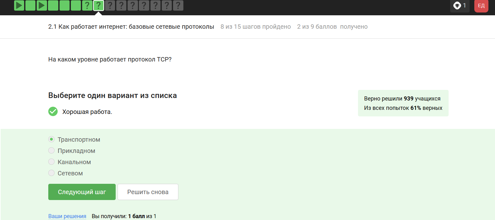
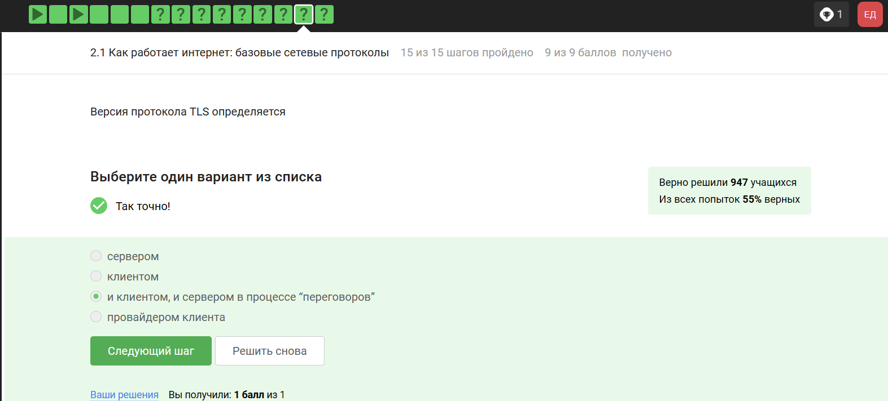
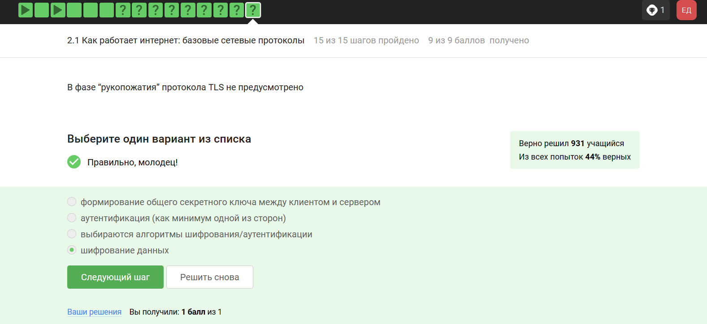
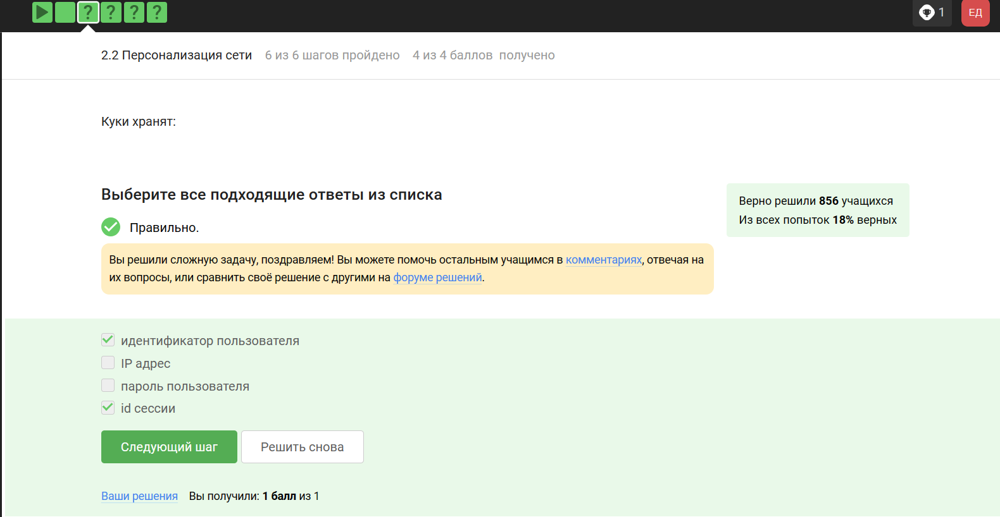
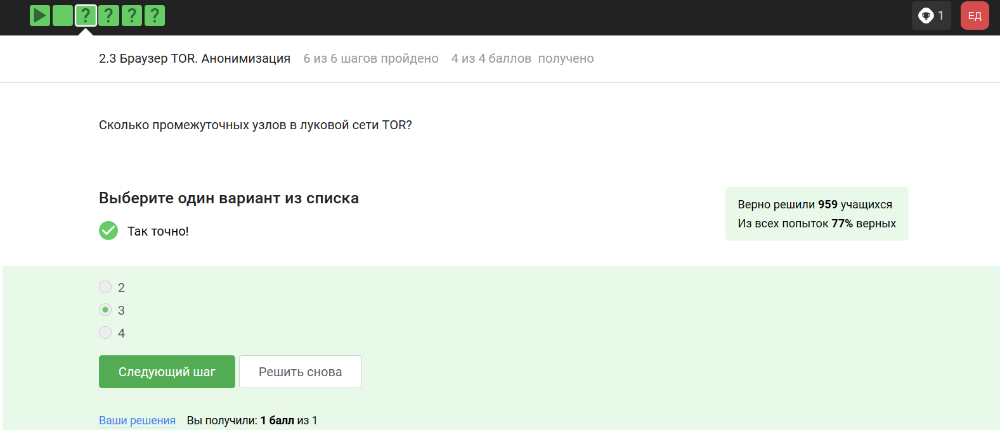
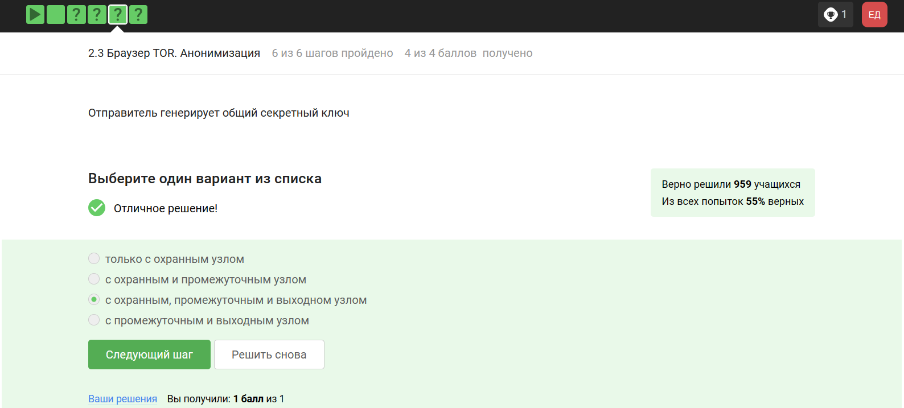
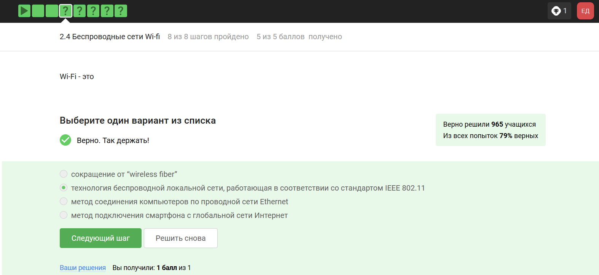

---
## Front matter
lang: ru-RU
title: Презентация по лабораторной работе №1
subtitle: Основы информационной безопасности
author:
  - Ахатов Э.Э.
institute:
  - Российский университет дружбы народов, Москва, Россия
date: 1 мая 2026

## i18n babel
babel-lang: russian
babel-otherlangs: english

## Fonts
fontfamily: libertinus
mainfont: Liberation Serif
sansfont: Liberation Sans
monofont: Liberation Mono
mainfontoptions: Ligatures=TeX
romanfontoptions: Ligatures=TeX
sansfontoptions: Ligatures=TeX,Scale=MatchLowercase
monofontoptions: Scale=MatchLowercase,Scale=0.9

## Formatting pdf
toc: false
toc-title: Содержание
slide_level: 2
aspectratio: 169
section-titles: true
theme: metropolis
header-includes:
 - \metroset{progressbar=frametitle,sectionpage=progressbar,numbering=fraction}
 - '\makeatletter'
 - '\beamer@ignorenonframefalse'
 - '\makeatother'
---

## Цель

Выполнение контрольных заданий первого блока курса "Основы Кибербезопасности"

## Задание

выполнить задания курса

## 1 вопрос

{#fig:001 width=70%}

Tcp - transmission control protocol - работает на транспортном уровне

## 2 вопрос

{#fig:002 width=70%}

В адрессе типа Ipv4 не может быть чисел больше 255 

## 3 вопрос

{#fig:003 width=70%}

Dns-сервер - приложение предназначенное для ответов на днс запросы

## 4 вопрос

{#fig:004 width=70%}

распределение протоколов в модели TCP/IP:

- Прикладной уровень: HTTP,RTSP,FTP,DNS

- Транспортный уровень: TCP, UDP, SCTP, DCCP

- Уровень сетевого доступа: Ethernet, IEE 802.11, WLAN, SLIP,ATM

## 5 вопрос

{#fig:005 width=70%}

Протокол HTTP передает не зашифрованные данные, а протокол уже будет передавать зашифрованные

## 6 вопрос

{#fig:006 width=70%}

одна из фаз передача данных, другая должна быть рукопожатием

## 7 вопрос

{#fig:007 width=70%}

## 8 вопрос

TLS определяется и клиентом и сервером

## 8 вопрос

{#fig:008 width=70%}

## 9 вопрос

{#fig:009 width=70%}

## 10 вопрос

куки точно не хранят пароли и айпи адреса

{#fig:010 width=70%}

куки не делают соединение более надежным

## 11 вопрос

{#fig:011 width=70%}

ответ на изображении

## 12 вопрос

{#fig:012 width=70%}

Сессионные куки хранятся в течение сессии 

## 13 вопрос

{#fig:013 width=70%}

Необходимо три узла-входной,промежуточный и выходной

## 14 вопрос

{#fig:014 width=70%}

айпи адрес не должен быть известен охранному и промежуточному узлам

## 15 вопрос

{#fig:015 width=70%}

Отправитель генерирует общий секретный ключ

## 16 вопрос

{#fig:016 width=70%}

для получения пакетов не нужно использовать тор

## 17 вопрос

{#fig:017 width=70%}

Действительно, это определение WI-FI

## 18 вопрос

{#fig:018 width=70%}

он распологается как канальный уровень

## 19 вопрос

{#fig:019 width=70%}

это устаревший и небезопасный метод проверки подлинности

## 20 вопрос

{#fig:020 width=70%}

Нужно аутентифицировать устройства и позже передаются зашифрованные данные

## 21 вопрос

{#fig:021 width=70%}

для личного использования

## 22 вопрос

{#fig:022 width=70%}

## Вывод

В ходе выполнения работы я узнал о работе сетевых протоколов, куки, сетей и браузера ТОР

