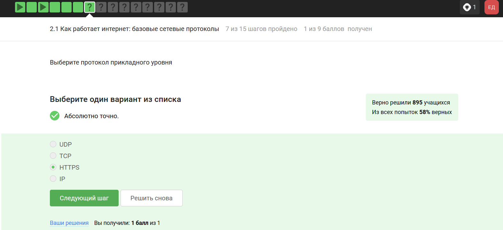
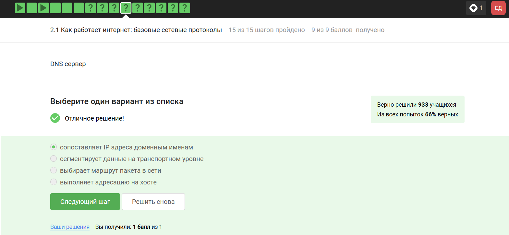
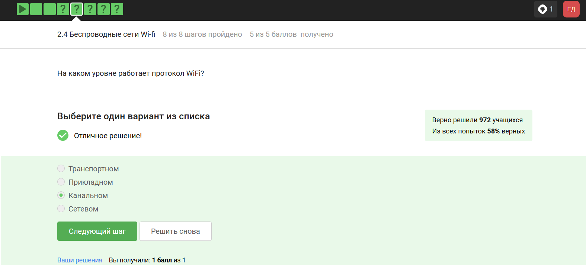

---
## Front matter
title: "Внешний курс. Блок 1: Безопасность в сети"
subtitle: "Основы информационной безопасности"
author: "Ахатов Эмиль"

## Generic otions
lang: ru-RU
toc-title: "Содержание"

## Bibliography
bibliography: bib/cite.bib
csl: pandoc/csl/gost-r-7-0-5-2008-numeric.csl

## Pdf output format
toc: true # Table of contents
toc-depth: 2
lof: true # List of figures
fontsize: 12pt
linestretch: 1.5
papersize: a4
documentclass: scrreprt
## I18n polyglossia
polyglossia-lang:
  name: russian
  options:
	- spelling=modern
	- babelshorthands=true
polyglossia-otherlangs:
  name: english
## I18n babel
babel-lang: russian
babel-otherlangs: english
## Fonts
fontfamily: libertinus
mainfont: Liberation Serif
sansfont: Liberation Sans
monofont: Liberation Mono
mathfont: STIX Two Math
mainfontoptions: Ligatures=Common,Ligatures=TeX,Scale=0.94
romanfontoptions: Ligatures=Common,Ligatures=TeX,Scale=0.94
sansfontoptions: Ligatures=Common,Ligatures=TeX,Scale=MatchLowercase,Scale=0.94
monofontoptions: Scale=MatchLowercase,Scale=0.94,FakeStretch=0.9
mathfontoptions:
## Biblatex
biblatex: true
biblio-style: "gost-numeric"
biblatexoptions:
  - parentracker=true
  - backend=biber
  - hyperref=auto
  - language=auto
  - autolang=other*
  - citestyle=gost-numeric
## Pandoc-crossref LaTeX customization
figureTitle: "Рис."
tableTitle: "Таблица"
listingTitle: "Листинг"
lofTitle: "Список иллюстраций"
lolTitle: "Листинги"
## Misc options
indent: true
header-includes:
  - \usepackage{indentfirst}
  - \usepackage{float} # keep figures where there are in the text
  - \floatplacement{figure}{H} # keep figures where there are in the text
---

# Цель работы

Выполнение контрольных заданий первого блока курса "Основы Кибербезопасности"

# Выполнение заданий 

## Как работает интернет

{#fig:001 width=70%}

Tcp - transmission control protocol - работает на транспортном уровне

{#fig:002 width=70%}

В адрессе типа Ipv4 не может быть чисел больше 255 

{#fig:003 width=70%}

Dns-сервер - приложение предназначенное для ответов на днс запросы

{#fig:004 width=70%}

распределение протоколов в модели TCP/IP:

- Прикладной уровень: HTTP,RTSP,FTP,DNS

- Транспортный уровень: TCP, UDP, SCTP, DCCP

- Уровень сетевого доступа: Ethernet, IEE 802.11, WLAN, SLIP,ATM

{#fig:005 width=70%}

Протокол HTTP передает не зашифрованные данные, а протокол уже будет передавать зашифрованные

{#fig:006 width=70%}

одна из фаз передача данных, другая должна быть рукопожатием

{#fig:007 width=70%}

TLS определяется и клиентом и сервером

{#fig:008 width=70%}

{#fig:009 width=70%}

## Персонализация сети

куки точно не хранят пароли и айпи адреса

{#fig:010 width=70%}

куки не делают соединение более надежным

{#fig:011 width=70%}

ответ на изображении

{#fig:012 width=70%}

Сессионные куки хранятся в течение сессии 

{#fig:013 width=70%}

## Браузер TOR

Необходимо три узла-входной,промежуточный и выходной

{#fig:014 width=70%}

айпи адрес не должен быть известен охранному и промежуточному узлам

{#fig:015 width=70%}

Отправитель генерирует общий секретный ключ

{#fig:016 width=70%}

для получения пакетов не нужно использовать тор

{#fig:017 width=70%}

## Беспроводные сети WI-FI

Действительно, это определение WI-FI

{#fig:018 width=70%}

он распологается как канальный уровень

{#fig:019 width=70%}

это устаревший и небезопасный метод проверки подлинности

{#fig:020 width=70%}

Нужно аутентифицировать устройства и позже передаются зашифрованные данные

{#fig:021 width=70%}

для личного использования

{#fig:022 width=70%}

# Выводы

В ходе выполнения работы я узнал о работе сетевых протоколов, куки, сетей и браузера ТОР
