---
## Front matter
title: "Внешний курс. Блок 2: Защита ПК/Телефона"
subtitle: "Основы информационной безопасности"
author: "Ахатов Эмиль"
## Generic otions
lang: ru-RU
toc-title: "Содержание"

## Bibliography
bibliography: bib/cite.bib
csl: pandoc/csl/gost-r-7-0-5-2008-numeric.csl

## Pdf output format
toc: true # Table of contents
toc-depth: 2
lof: true # List of figures
fontsize: 12pt
linestretch: 1.5
papersize: a4
documentclass: scrreprt
## I18n polyglossia
polyglossia-lang:
  name: russian
  options:
	- spelling=modern
	- babelshorthands=true
polyglossia-otherlangs:
  name: english
## I18n babel
babel-lang: russian
babel-otherlangs: english
## Fonts
fontfamily: libertinus
mainfont: Liberation Serif
sansfont: Liberation Sans
monofont: Liberation Mono
mathfont: STIX Two Math
mainfontoptions: Ligatures=Common,Ligatures=TeX,Scale=0.94
romanfontoptions: Ligatures=Common,Ligatures=TeX,Scale=0.94
sansfontoptions: Ligatures=Common,Ligatures=TeX,Scale=MatchLowercase,Scale=0.94
monofontoptions: Scale=MatchLowercase,Scale=0.94,FakeStretch=0.9
mathfontoptions:
## Biblatex
biblatex: true
biblio-style: "gost-numeric"
biblatexoptions:
  - parentracker=true
  - backend=biber
  - hyperref=auto
  - language=auto
  - autolang=other*
  - citestyle=gost-numeric
## Pandoc-crossref LaTeX customization
figureTitle: "Рис."
tableTitle: "Таблица"
listingTitle: "Листинг"
lofTitle: "Список иллюстраций"
lolTitle: "Листинги"
## Misc options
indent: true
header-includes:
  - \usepackage{indentfirst}
  - \usepackage{float} # keep figures where there are in the text
  - \floatplacement{figure}{H} # keep figures where there are in the text
---

# Цель работы

Пройти второй блок курса "Основы кибербезопасности"

# Выполнение блока 2: Защита ПК/Телефона

шифрование диска-технология защиты информации

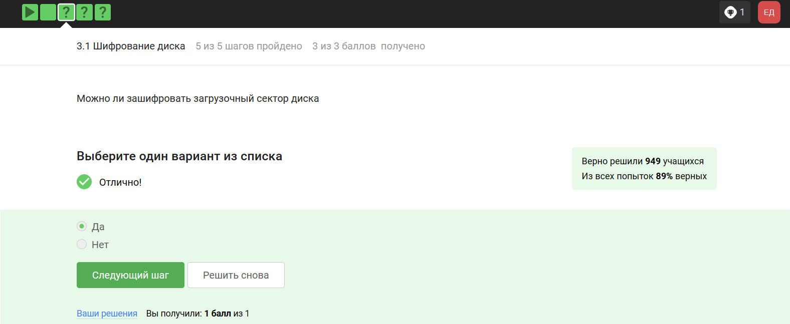{#fig:001 width=70%}

Шифрование диска основано на симметричном шифровании

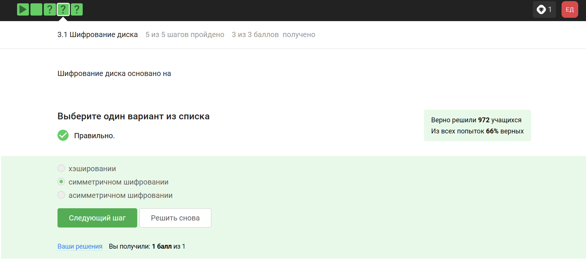{#fig:002 width=70%}

Отмечены программы с помощью которых можно зашифровать

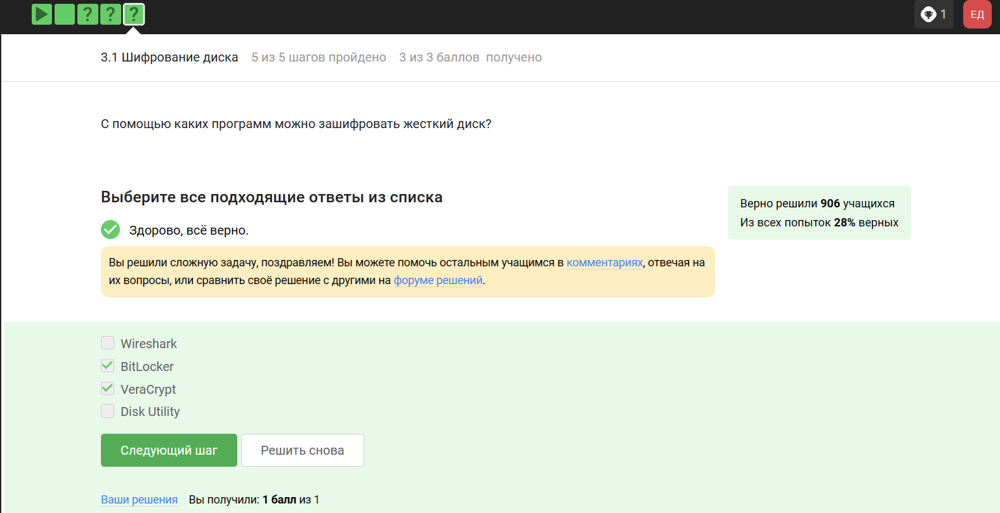{#fig:003 width=70%}

Пароль который трудно подобрать - это стойкий пароль

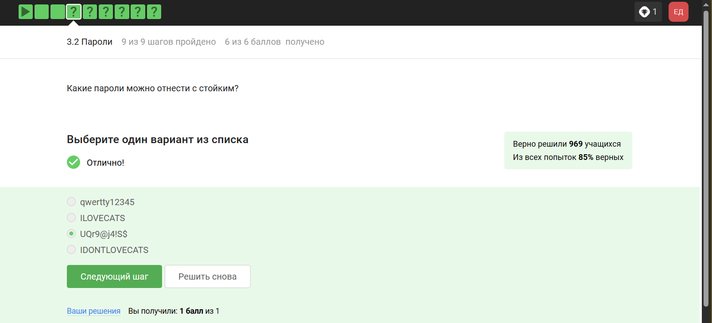{#fig:004 width=70%}

все варианты кроме менеджера паролей не надежны

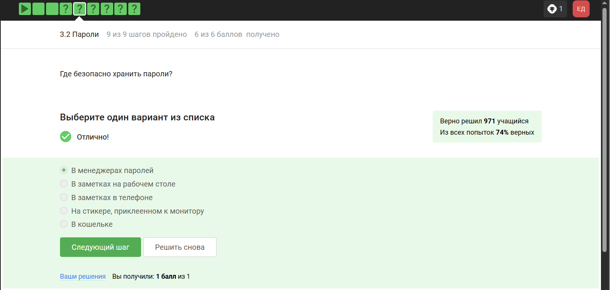{#fig:005 width=70%}

капча нужна для проверки, что за экраном не робот

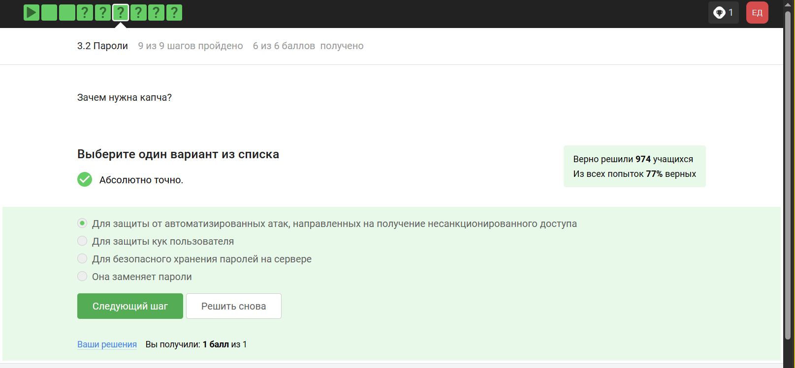{#fig:006 width=70%}

опасно хранить в открытом виде

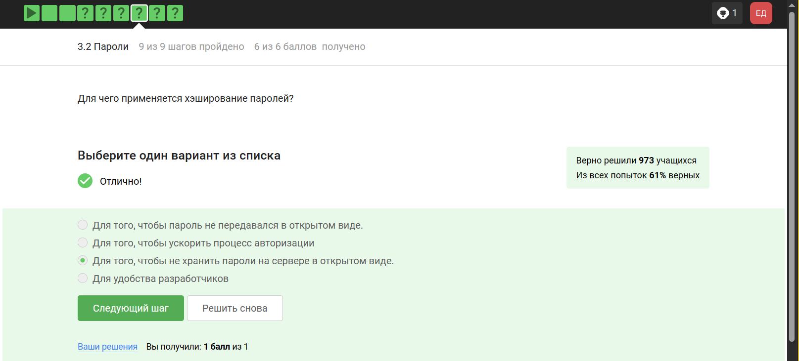{#fig:007 width=70%}

соль не поможет

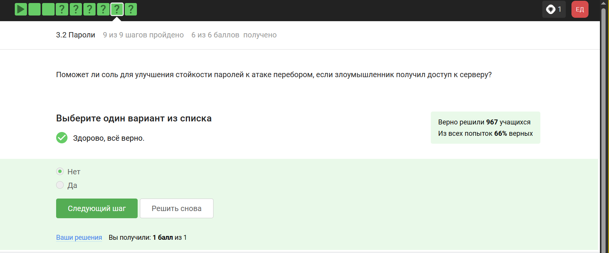{#fig:008 width=70%}

все приведенные меры защищают от утечки данных

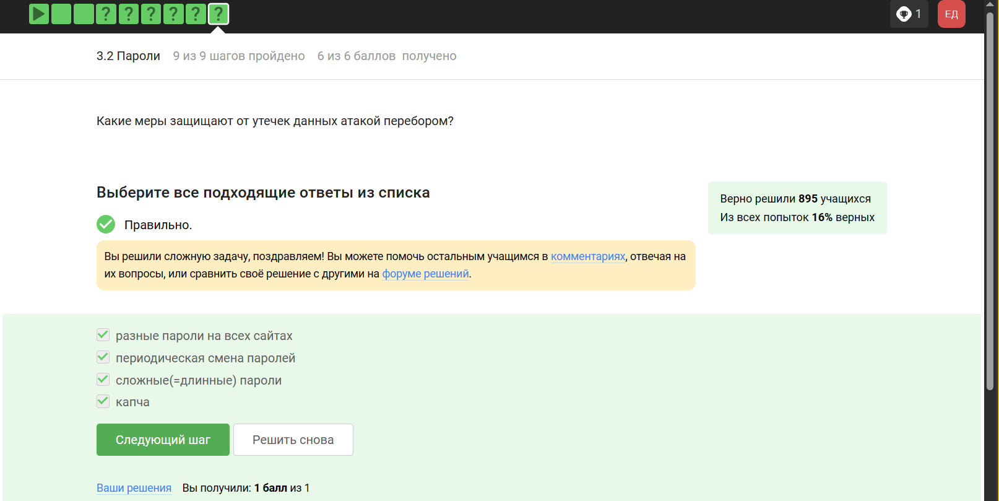{#fig:009 width=70%}

фишинговые ссылки очень похожи на ссылки известных сервисов

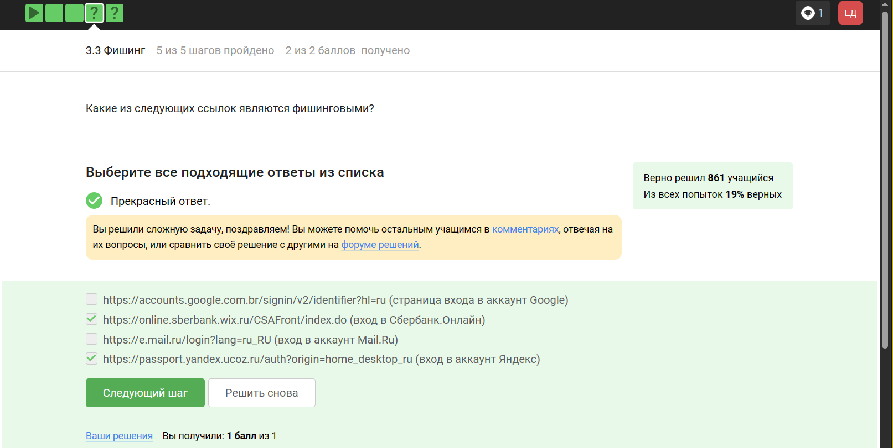{#fig:010 width=70%}

да может

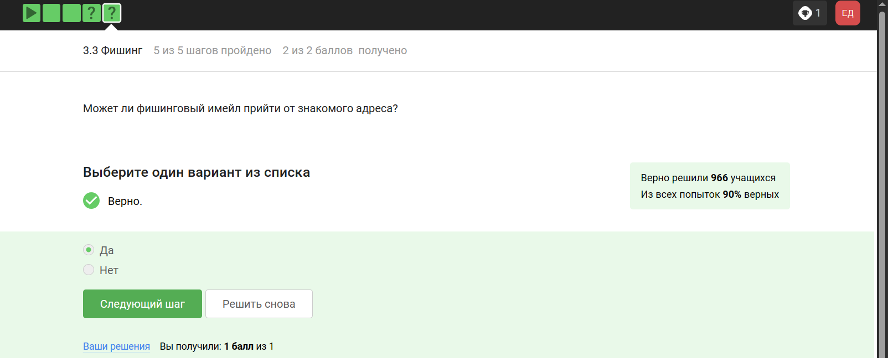{#fig:011 width=70%}

ответ дан в соответствии с определением

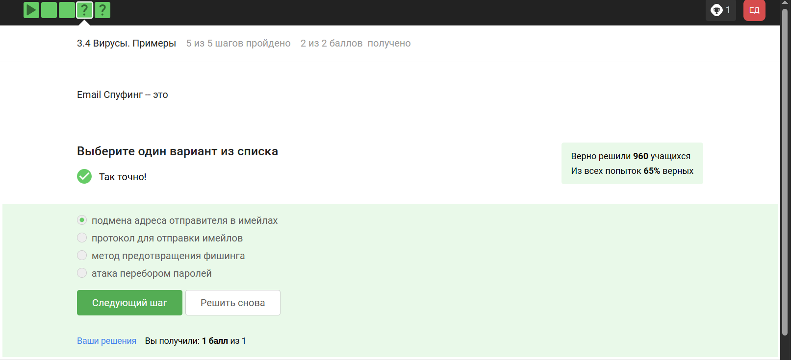{#fig:012 width=70%}

троян маскируется под обычную программу

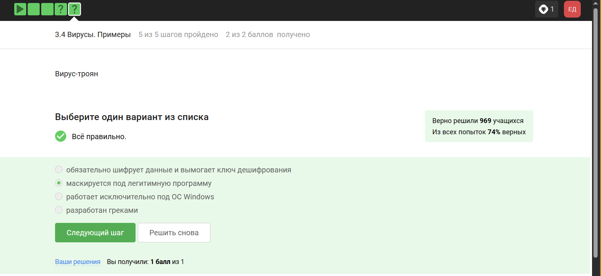{#fig:013 width=70%}

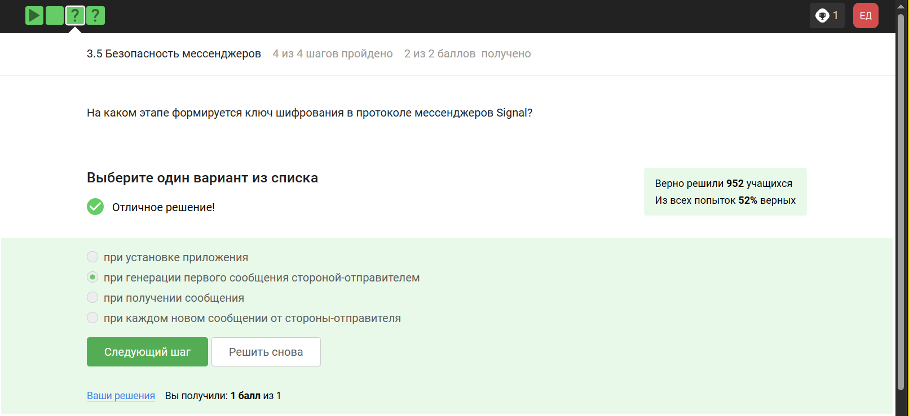{#fig:014 width=70%}

суть сквозного шифрования

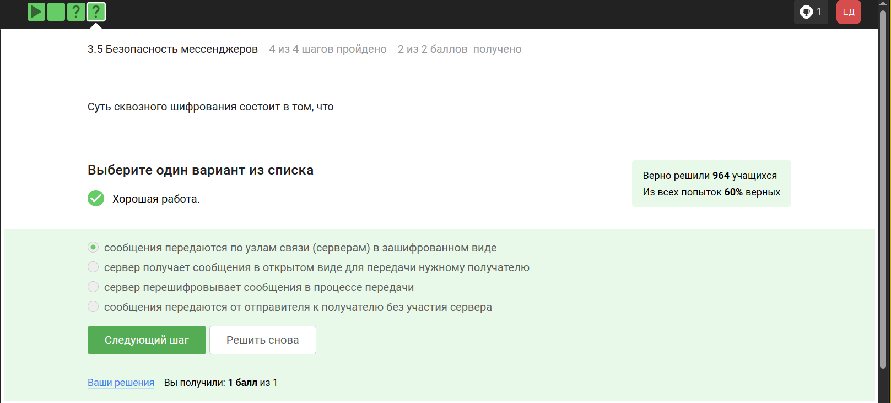{#fig:015 width=70%}
