---
## Front matter
lang: ru-RU
title: Внешний курс 2 этап
subtitle: Основы информационной безопасности
author:
  - Ахатов Э.Э.
institute:
  - Российский университет дружбы народов, Москва, Россия
date: 1 мая 2026

## i18n babel
babel-lang: russian
babel-otherlangs: english

## Fonts
fontfamily: libertinus
mainfont: Liberation Serif
sansfont: Liberation Sans
monofont: Liberation Mono
mainfontoptions: Ligatures=TeX
romanfontoptions: Ligatures=TeX
sansfontoptions: Ligatures=TeX,Scale=MatchLowercase
monofontoptions: Scale=MatchLowercase,Scale=0.9

## Formatting pdf
toc: false
toc-title: Содержание
slide_level: 2
aspectratio: 169
section-titles: true
theme: metropolis
header-includes:
 - \metroset{progressbar=frametitle,sectionpage=progressbar,numbering=fraction}
 - '\makeatletter'
 - '\beamer@ignorenonframefalse'
 - '\makeatother'
---

## Цель работы

Пройти третий блок курса "Основы кибербезопасности"

## Введение в криптографию
 
Для ответа на вопрос используется определение ассмиетричного шифрования с двумя ключами (рис. [-@fig:001]).

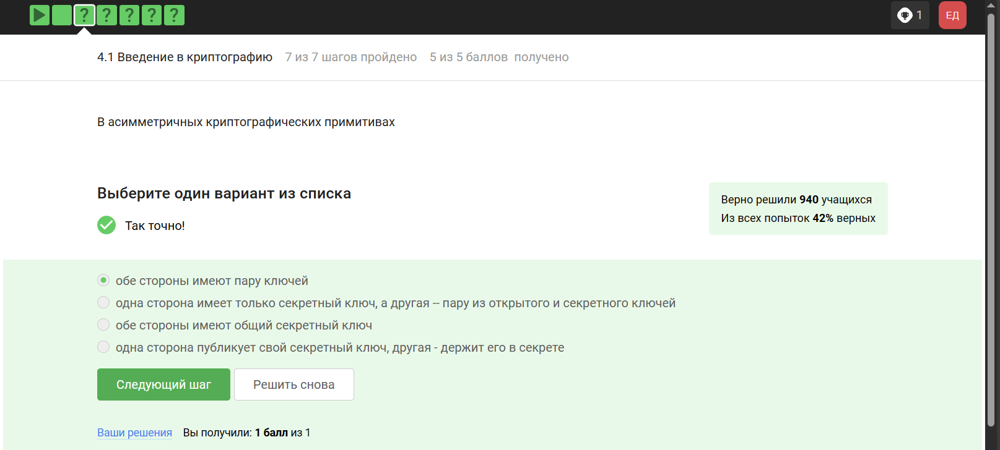{#fig:001 width=70%}

## Отмечены основные условия для криптографической хэш-функции (рис. [-@fig:002]).

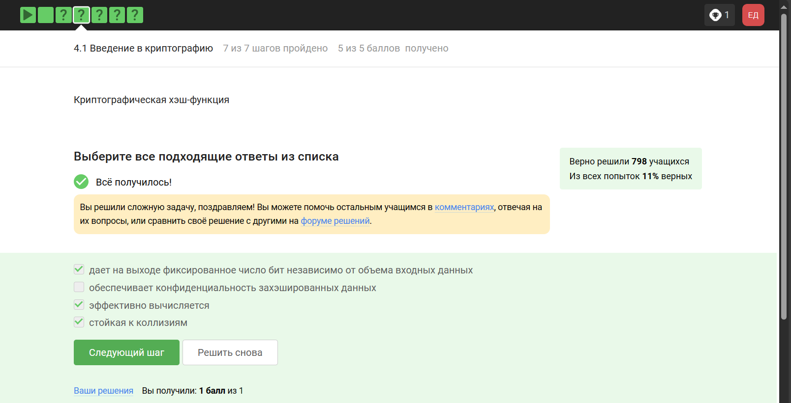{#fig:002 width=70%}

## Отмечены алгоритмы цифровой подписи (рис. [-@fig:003]).

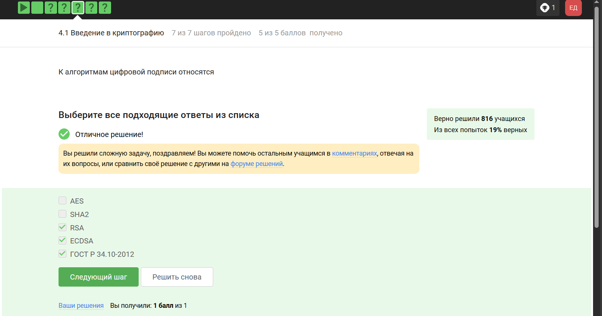{#fig:003 width=70%}

##

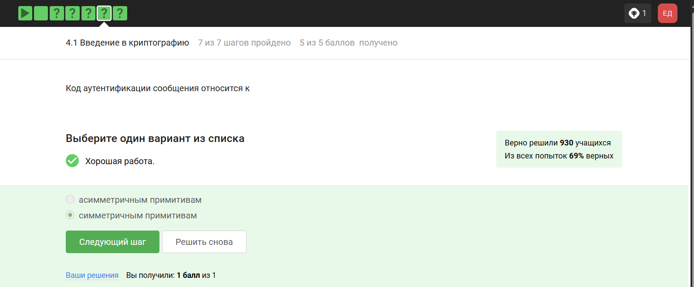{#fig:004 width=70%}

## Определение обмена ключами Диффи-Хэллмана. (рис. [-@fig:005]).

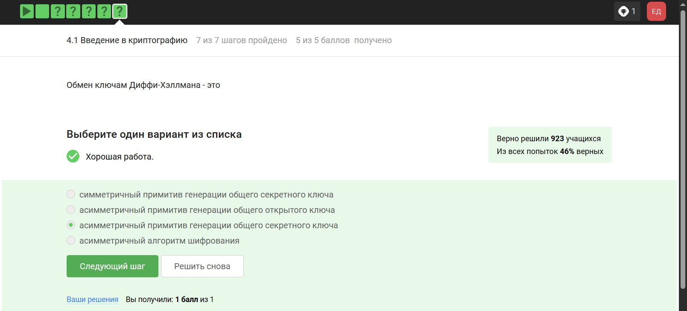{#fig:005 width=70%}

## Цифровая подпись

## По определению цифровой подписи протокол ЭЦП относится к протоколам с публичным ключом (рис. [-@fig:006]).

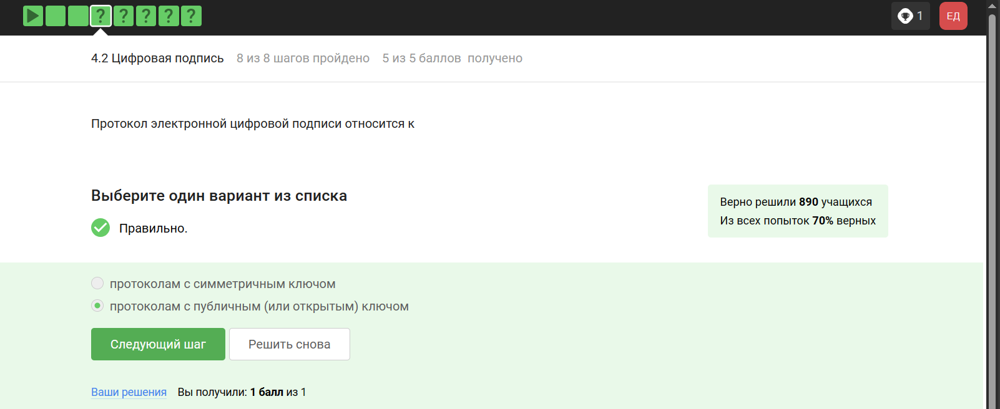{#fig:006 width=70%}

##

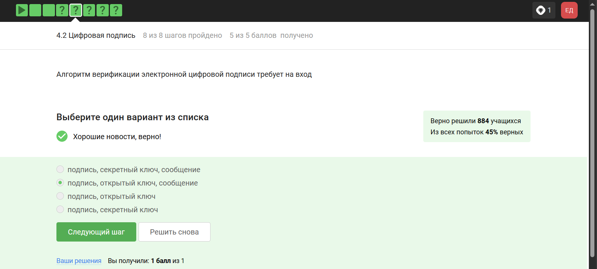{#fig:007 width=70%}

## Электронная подпись обеспечивает все указанное, кроме конфиденциальности (рис. [-@fig:008]).

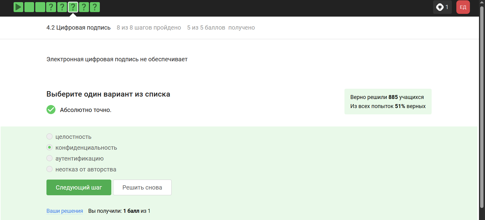{#fig:008 width=70%}

## Для отправки налоговой отчетности в ФНС используется усиленная квалифицированная электронная подпись (рис. [-@fig:009]).

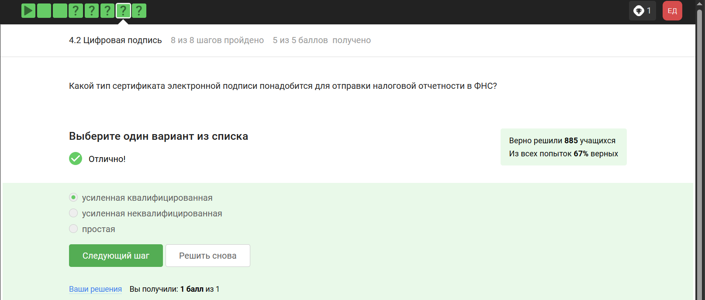{#fig:009 width=70%}

## Верный ответ укзаан на изображении (рис. [-@fig:010]).

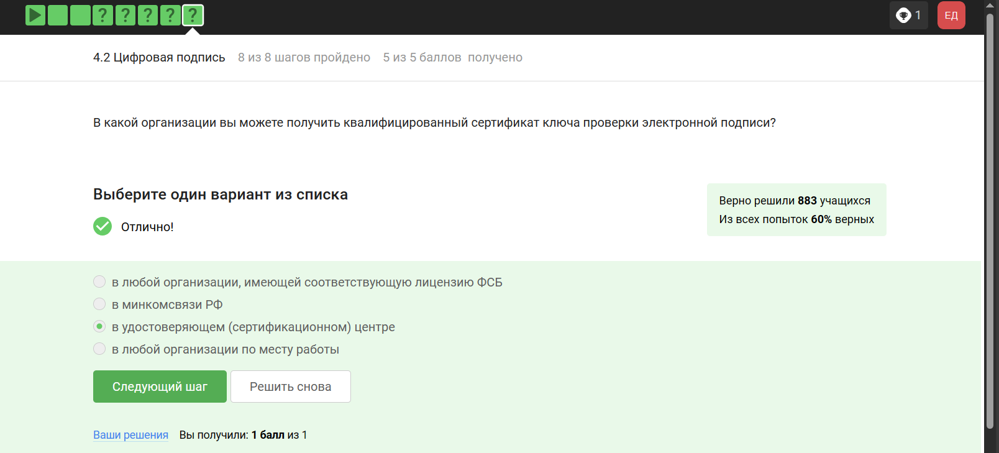{#fig:010 width=70%}

## Электронные платежи

Известные платежные системы - Visa, MasterCard, МИР (рис. [-@fig:011]).

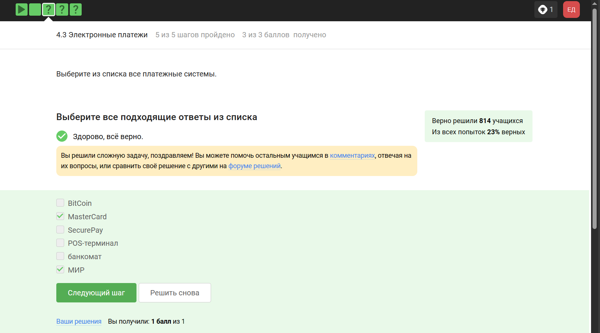{#fig:011 width=70%}

## Верный ответ на изображении (рис. [-@fig:012]).

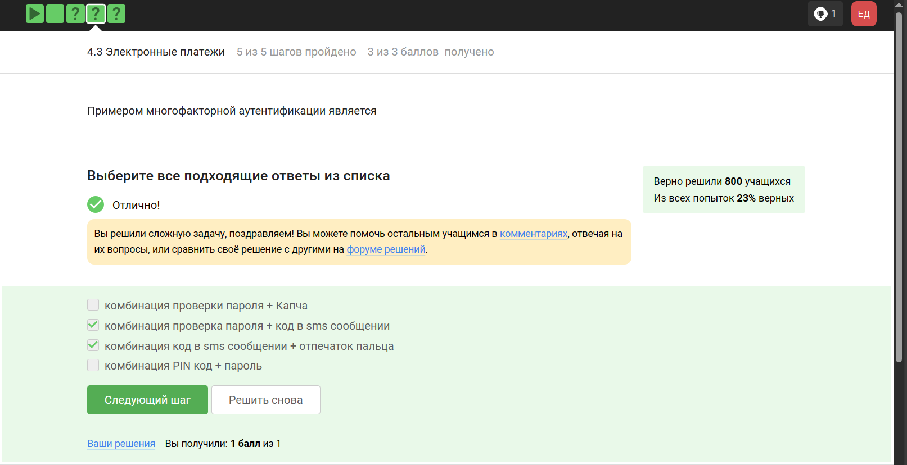{#fig:012 width=70%}

## При онлайн платежах используется многофакторная аутентификация (рис. [-@fig:013]).

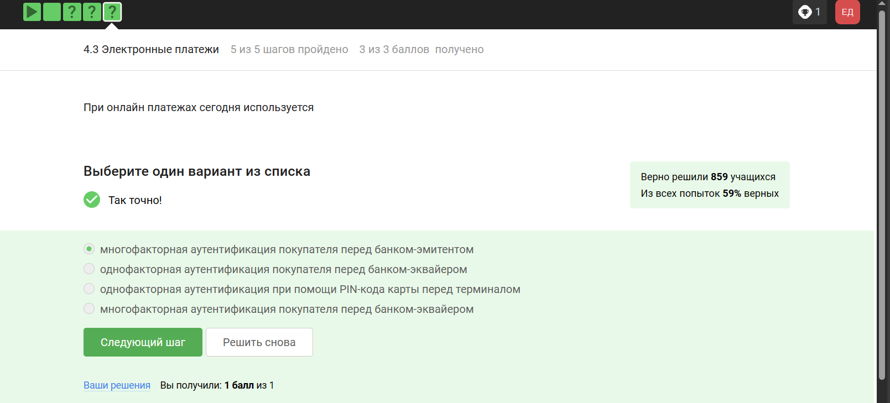{#fig:013 width=70%}

## Блокчейн

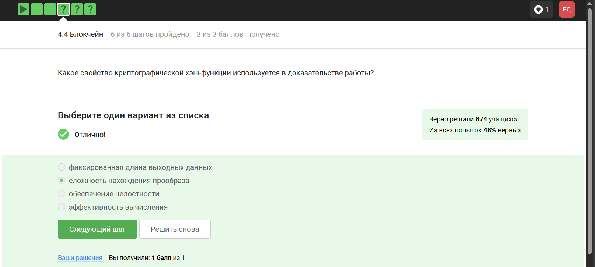{#fig:014 width=70%}

## Консенсус блокчейна — это процедура, в ходе которой участники сети достигают согласия о текущем состоянии данных в сети. Благодаря этому алгоритмы консенсуса устанавливают надежность и доверие к самоу сети. (рис. [-@fig:015]).

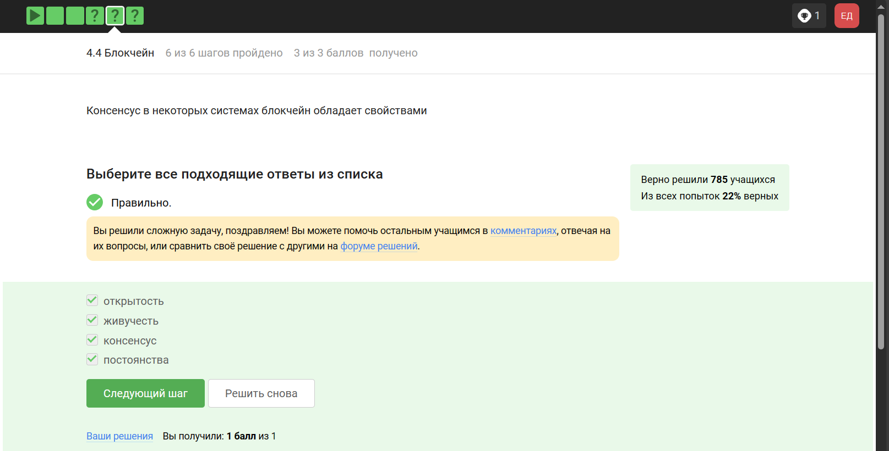{#fig:015 width=70%}

## Ответ - цифровая подпись (рис. [-@fig:016]).

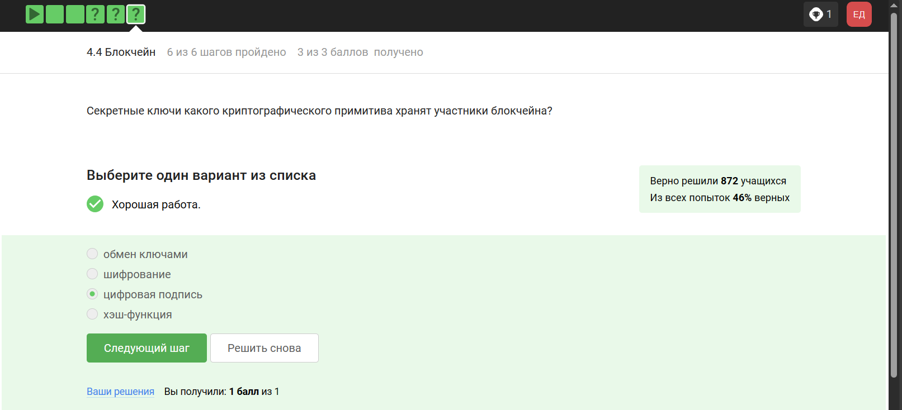{#fig:016 width=70%}

