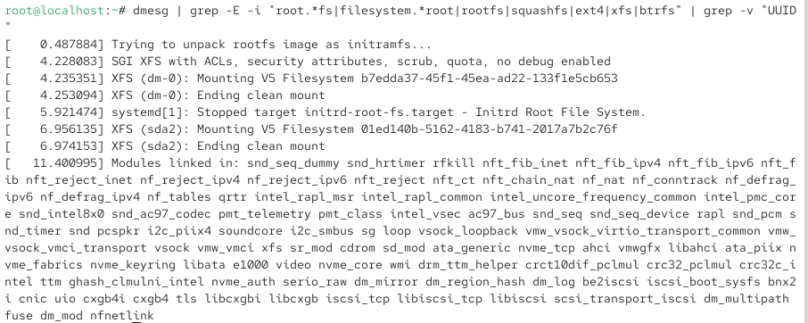

## Информация

Докладчик:

- Ахатов Эмиль Эрнстович  
- студент группы НКАбд-04-24  
- Российский университет дружбы народов  

---

## Цель работы

Целью данной работы является приобретение практических навыков установки операционной системы на виртуальную машину и настройки минимально необходимых для дальнейшей работы сервисов.

---

## Задание

1. Установка и настройка операционной системы.
2. Определить:
   - версию ядра Linux;
   - частоту процессора;
   - модель процессора;
   - объём доступной оперативной памяти;
   - тип обнаруженного гипервизора;
   - тип файловой системы корневого раздела.

---

## Выполнение лабораторной работы

Я создал новую виртуальную машину и выделил:

- 8 ГБ оперативной памяти;
- 4 ядра процессора;
- 40 ГБ дискового пространства;
- максимальный объём видеопамяти.

В разделе дополнительного программного обеспечения выбрал окружение «Средства разработки» и отключил службу kdump.

Поскольку процесс установки повторяет действия из предыдущего курса, скриншоты каждого шага не приводятся.

---

## Результат 1

{ width=80% }

---

## Результат 2

{ width=80% }

---

## Вывод

В ходе выполнения лабораторной работы я приобрёл практические навыки установки операционной системы на виртуальную машину и настройки минимально необходимых сервисов.
